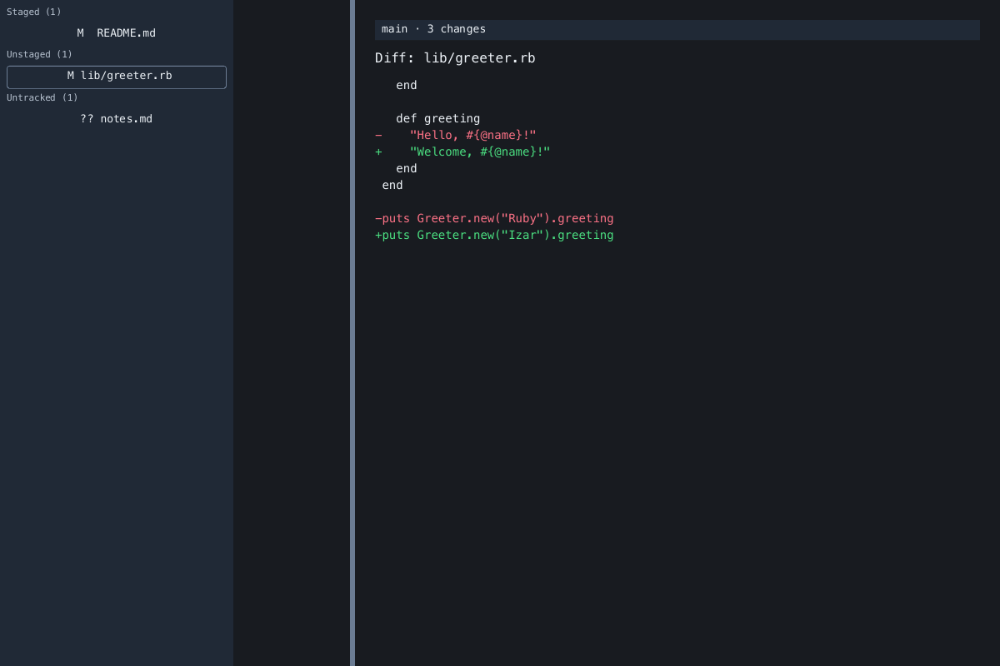

Izar reviews and stages changes in an existing Git repository. Use its terminal
workspace, native window, or individual commands. Repository operations run in
Ruby through Thuban and Porrima without invoking the `git` executable.

## Install Izar

You need Ruby 3.2 or newer and a Git repository with a working tree. Install the
gem:

```sh
gem install izar
```

The interactive terminal workspace needs a terminal for both input and output.
The native window uses Zaniah's macOS, Linux, or Windows backend and needs a
working desktop environment. If that backend cannot open, Izar falls back to the
terminal workspace. See [workspace modes](usage.md#choose-a-workspace).

For a source checkout, install the dependencies with `bundle install` and run
`bundle exec exe/izar` from the checkout directory.

## Open your first repository

Change to the root of a repository you already work on:

```sh
cd /path/to/project
izar status
```

Replace `/path/to/project` with your repository directory. Izar shows your branch,
three change groups, and a diff for the first changed path:

| Group | Contains |
| --- | --- |
| Staged | Changes already in the index, ready to commit |
| Unstaged | Tracked files whose working-tree content differs from the index |
| Untracked | New files that are not in the index |

A partially staged file can appear in both Staged and Unstaged. The displayed
diff compares the index with the working tree; a fully staged file may therefore
have an empty diff. Use [the Ruby API](repository-api.md#compare-and-stage-hunks)
when you need a HEAD-to-index diff.

To open the interactive terminal workspace:

```sh
izar status --tui
```

Use `j` and `k` to move between paths. Press Space to stage the selected file,
then `q` to exit. The [workspace guide](usage.md) explains hunk staging, filtering,
commit messages, and discard confirmation.

To open a native window instead:

```sh
izar status --gui
```



The screenshot shows the native workspace with example repository changes.

## Stage and commit a change

After editing a tracked file, substitute its repository-relative path for
`README.md`:

```sh
izar stage README.md
izar status
izar commit -m "Update project notes"
```

`stage` copies the current file content into the index. `commit` creates a local
commit from all staged changes. It requires a non-empty message and at least one
staged change. Izar does not push commits to a remote.

To move the file out of the next commit while keeping your working-tree edits:

```sh
izar unstage README.md
```

Use `-C` to work with another repository without changing directories:

```sh
izar status -C ../project
```

Paths passed to `stage`, `unstage`, and `discard` are relative to that repository's
root, including when you launch Izar from a subdirectory.

## Troubleshooting

| Symptom | What to do |
| --- | --- |
| `not a Git repository` | Change into a repository or pass its directory with `-C`. |
| `Git author identity is missing` or `Git committer identity is missing` | Set your repository's `user.name` and `user.email`, or the corresponding Git author and committer environment variables. |
| `nothing staged` | Stage a changed file before committing. |
| `commit message cannot be empty` | Supply a message with `-m`, or enter one at the terminal prompt. |
| `discard requires confirmation` | Review the [discard behavior](usage.md#discard-a-file) before using `--yes`. |
| Configuration error | Check the field names and value types in [configuration](configuration.md). |
| A native window does not open | Run `izar status --tui` in an interactive terminal. |
| `--tui` prints a snapshot and exits | Run it with terminal input and output rather than through a pipe or redirected file. |

For example, configure your own commit identity with Git:

```sh
git config user.name "Your Name"
git config user.email "you@example.com"
```

Continue with [reviewing and staging changes](usage.md),
[configuration](configuration.md), or [the Ruby API](repository-api.md).
